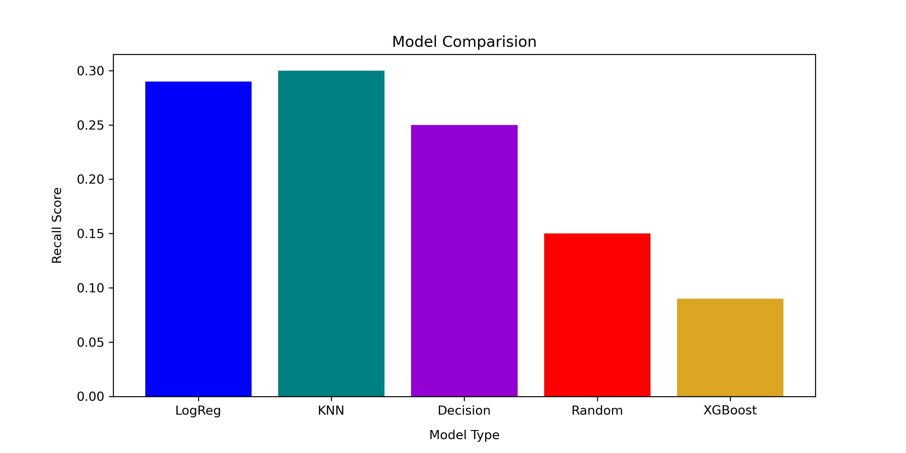

# Predicting Heart Disease


Author: Xiaohua Su

[Email](xiaohuasu99@gmail.com) | [Linkedin](http://www.linkedin.com/in/xiaohua-su)
# Overview

As of 2020, heart disease is the leading cause of death in the US, with the disease claiming close to 700,000 that year[1]. 
It is the leading cause of death regardless of gender and for most race/ethnicity[2]. This disease can lead to early death in individuals, increase medical visits and a lost of productivity in our economy. Not only that but 80-90% of this heart disease can be prevented[3]. As such, it is important to try to address this. This project aims to help build a predictive model for heart disease from non-lab work. By being able to predict whether a patient has heart disease or not, this can be used in hospital to flag doctors to discuss way to manage this disease and prevent early death and potentially slow/mitigate the disease progression without having to wait for lab results.

# Problem

With how prevalent heart disease is in the nation, it is important for doctors to discuss with their patients about early prevention. In order to do this, doctors would need to know more about a patient’s history in order to diagnose them with having heart disease, potentially requiring blood work and other lab work in addition. Getting the results from the blood work usually happens after the patient’s is already out of the doctor’s office and any discussion would happen later on, delaying early intervention.

Our model aims to predict whether a patient, who comes into a doctor’s office/hospital, has heart disease. By being able to predict if the patient has heart disease or not, we can then flag this patient for the doctor electronically. Instead of having to waiting for a phone call for a discussion on this, a conversation between the doctor and patient about managing heart disease, early intervention and prevention can begin once they see the doctor that same day. This flagging can help lead the doctor in asking certain questions for further verification and testing. By diagnosing it earlier, you can help slow the disease progression, keeping them healthier longer.

# Data
The data was taken from the [CDC's 2020 Behavorial Risk Factor Surveillance System](https://www.cdc.gov/brfss/annual_data/annual_2020.html) (BRFSS).Due to how large the data is, this data was not uploaded to the GitHub but can be found where the data was taken underneath the data files section.The heart disease dataset was created from that 2020 survey and can be found in this repository's [data](https://github.com/xiaohua-su/Heart_Disease/tree/main/Data) folder.

It is a survey data performed between 2020 and 2021 from the CDC. This dataset comprised 400,000 responses and had responses from the 50 states plus DC, Puerto Rico and Guam. This survey is used to monitor people's health-behavior, chronic health conditions, and use of services to help manage their disease.The data contains information of the individual such as `race` and `gender` that we did not include in the heart disease dataset to avoid these biases in our models.A new column was created as the data does not specifically have a column called heart disease but instead had two columns called `cvdinfr4` and `cvdcrhd4` that corresponded with whether the individual was ever told/diagnose with having a heart attack and told that they had coronary heart disease respectively.Both questions, get at the issue of heart disease. It is important to note that while both heart attack and coronary artery disease are considered part of heart disease, they are not the only condition in this category. There are other conditions such as congenital heart issues, and rhythm issue that fall under heart disease that are not captured in this dataset.

# Results




On model performance, KNN performed the best at 0.30 recall. The logistic recall was 0.29.


The confusion matrix shows better how the KNN model predicted. More than half off of those that had heart disease were misclassified. 
Still the model was able to classify some with heart disease correctly. Some that don’t have heart disease were misclassified as having heart disease.

The recall of the KNN was 0.30 which also indicated that it's over fit as the training score was 0.64 with an ROC-AUC score of 0.80.


# App

**This app would be implemented in a health care system and should not be used as a final diagnosis of any kind, nor should anyone who download this be using it as a self diagnosis**

The app used the logistic regression model because it ran faster and its recall is comparable to the KNN model.

 Our second best model was deployed in an app. The function development in the [app.py](./app.py) file can be found in the app development notebook. In addition, the code used to make the app on streamlit can be found in the app.py. Unfortunately, due to how big the model file is (4 Gb), I was unable to implement my model on the streamlit website, but managed to run it locally. As such, it is not available for others to use on an website. In my GitHub, I have provided the streamlit environment in which I created it. This app can be run locally with the streamlit environment along with running the modeling notebook in order to get the model file into your local computer.

# Next Steps
The next step for this project would be to further refine our target. This projects only looks at heart attack and Coronary Artery Disease. These two conditions are some conditions that fall under the heart disease. Heart disease encompasses other conditions such as high blood pressure, congenital heart disease etc., it's not just CAD and heart attacks as such we would have to refine the questions being asked individual.

Not only that but more time to refine our model. Due to computational limitation of my system and the computational time, I am not able to perform as much grid-searches to fine-tune the model even further. Not only that but we can refine our model on data from patients' information form and the diagnoses given by the doctor to help improve the flagging of individuals with such a condition that way their primary doctor know to discuss this with the patient.

Build a better app. The app created was for demonstrated purposes but can be made so that instead of having to fill in the information manually, it can capture the information from a picture of the history form from the individual.
# Conclusion

In conclusion, my model is able to predict whether someone has heart disease or not. Further refinement can by including from the patient's health form to see if that helps with identifying these individuals better. Not only that, but expanding what falls under heart disease as this project really only looks at coronary heart disease and heart attacks, when in reality there's other condition that fall under this umbrella. Finally, a better app can be made that is able to capture information from the patient history information paperwork as such nurse/health care receptionist does not need to manually fill this information on.

This model can be deployed in an app to be used in a hospital to flag a doctor on an individual. By being able to flag an individual as having heart disease, the doctor can start potentially asking other questions to the individual and do further test to confirm. But what is key, here is that a conversation with the doctor can begin and early intervention can occur. By talking about the heart health and ways to manage such a disease and other prevention, even if it's a misdiagnosis, the individual is now aware of this and can if they choose so start taking either preventative measures or start managing this disease. This is in hopes that we can keep the individual healthy and prevent early death due to this disease. Not only that, but some heart disease can be prevented by changing habits and behaviors. Thus, my model will identify these individual for the doctor when they fill out their health form.

# Repository Structure
```
├── Data
├── Images
├── Workspace
│       ├── modeling_attempt
│       └── nueral_network_attempt
├── .gitignore
├── Heart_disease_Modeling.ipynb
├── Heart_disease_EDA.ipynb
├── presentation.pdf
├── README.md
├── LICENSE
├── app.py
├── get_features.py
├── model.py
└── environment.yml
```
# How to run the notebooks

The [environment.yml](./environment.yml) file is the environment that was used to run this notebook, [EDA notebook](Heart_Disease_EDA.ipynb) and the streamlit app. This notebook requires scipy version 1.5.3 in order to run. When you install the environment into your local, it is possible that scipy updates to a newer version due to streamlit/phik and will need to downgrade it in order for sklearn to operate properly. If you have a MAC unfortunately you'll need to figure out what MAC specific dependencies will be required.

<div class="alert alert-block alert-danger">
<b>Danger:</b> In order to be able to run this notebook successfully, you must have at minimum 32 Gb of RAM or you run the risk of crashing your computer. This notebook was created on a i7-11800H cpu, and 32GB RAM laptop.
</div>

# References

[1] CDC. "*Heart Disease Facts*". CDC. Feb 2022.[Link](https://www.cdc.gov/heartdisease/facts.htm)

[2] CDC. "*About Heart Disease*". CDC. Sept 2021. [Link](https://www.cdc.gov/heartdisease/about.htm)

[3] AHA. "*CDC Prevention Programs*". AHA. May 2018. [Link](https://www.heart.org/en/get-involved/advocate/federal-priorities/cdc-prevention-programs)

